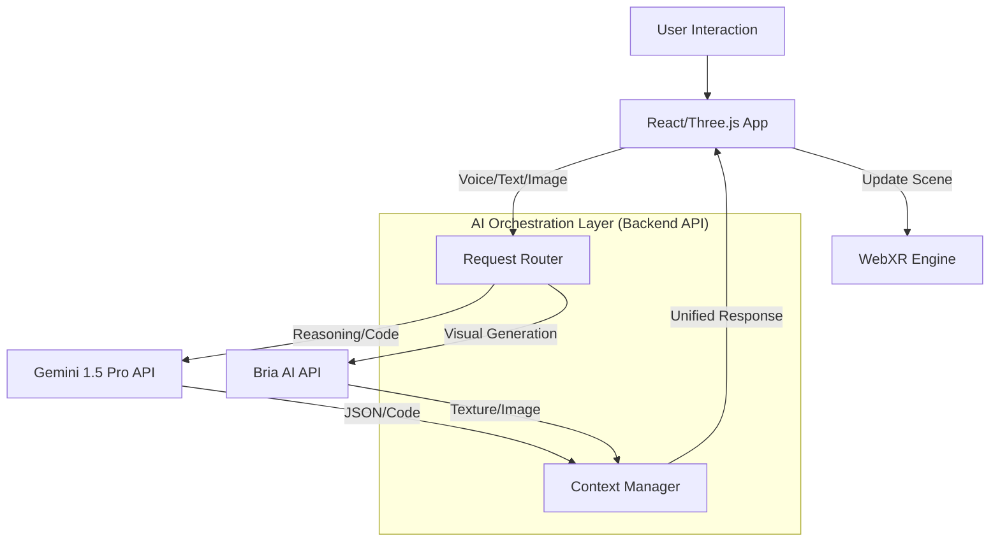

# AI Integration Strategy: Gemini & Bria AI

## Executive Summary
Innovana's immersive ecosystem leverages a dual-AI approach to deliver state-of-the-art experiences. We utilize **Gemini AI** as the "Brain" for intelligence, spatial reasoning, and dynamic logic, while **Bria AI** serves as the "Artist" for commercially safe, high-quality visual asset generation.

---

## 1. Gemini AI: The Intelligent Core 🧠
**Role:** Contextual Assistant, Spatial Reasoning Engine, Dynamic Code Generator.

### Key Use Cases

#### A. Intelligent Showroom Assistant
*   **Function:** A conversational agent within the virtual showroom that understands context.
*   **Capability:** Users can ask, "Show me furniture that matches this room's vibe," and Gemini analyzes the user's current view (via multimodal input) to recommend products.
*   **Integration:**
    *   **Input:** Text/Voice + Viewport Screenshot (Multimodal).
    *   **Output:** JSON structured data filtering the product catalog.

#### B. Spatial Reasoning & Layout Planning
*   **Function:** Analyzing the physical environment for optimal AR placement.
*   **Capability:** "Where fits a 6-person dining table?" Gemini analyzes the scanned room mesh/point cloud to identify suitable flat surfaces and clearance zones.
*   **Integration:**
    *   **Input:** LiDAR mesh data / Plane detection coordinates.
    *   **Output:** Vector coordinates (x, y, z) for object instantiation.

#### C. Dynamic Logic Generation
*   **Function:** Creating interactive behaviors on the fly.
*   **Capability:** A user wants a specific interaction, e.g., "Make the lights pulse when I touch the table." Gemini generates the specific Three.js/React code snippet to enable this behavior at runtime.
*   **Integration:**
    *   **Input:** Natural language command.
    *   **Output:** Executable Javascript/React code block (sandboxed).

---

## 2. Bria AI: The Visual Engine 🎨
**Role:** Texture Generator, Asset Customizer, Commercial Safety Guard.

### Key Use Cases

#### A. Runtime Texture Generation
*   **Function:** Generating high-quality, seamless textures for 3D models.
*   **Capability:** A user likes a sofa but wants it in "Vintage Victorian Velvet." Bria generates the specific texture map (albedo, normal, roughness) to apply to the 3D model instantly.
*   **Integration:**
    *   **Input:** Text prompt + Reference style.
    *   **Output:** Texture maps (JPG/PNG) applied to the Three.js material.

#### B. "Magic" Asset Customization
*   **Function:** Modifying existing 2D/3D assets while preserving structure.
*   **Capability:** Changing the background of a virtual environment or adding specific elements (e.g., "Add a vase to the table") using in-painting and object generation.
*   **Integration:**
    *   **Input:** Masked image area + Prompt.
    *   **Output:** Blended image asset.

#### C. Commercial Compliance
*   **Value:** Bria's models are trained on licensed data, ensuring that all generated assets (textures, backgrounds, marketing materials) are safe for commercial use by Innovana's enterprise clients.

---

## 3. Integration Architecture

## 4. Implementation Roadmap

### Phase 1: The Assistant (Gemini)
*   Implement a chat interface in the immersive view.
*   Connect to Gemini API for basic Q&A about the showroom.

### Phase 2: The Decorator (Bria)
*   Implement a "Material Swap" feature.
*   Connect to Bria API to generate textures based on user prompts and apply them to selected objects.

### Phase 3: The Spatial Planner (Gemini Advanced)
*   Integrate with WebXR plane detection.
*   Send room data to Gemini to suggest optimal furniture layouts.
